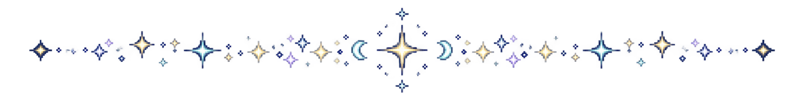
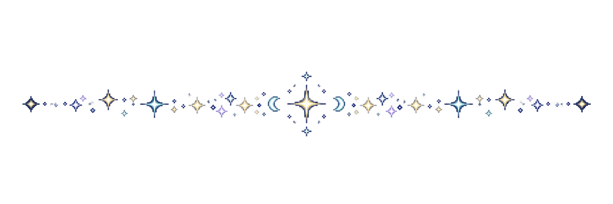
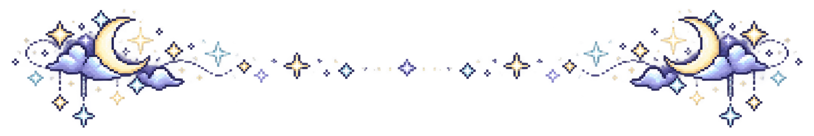
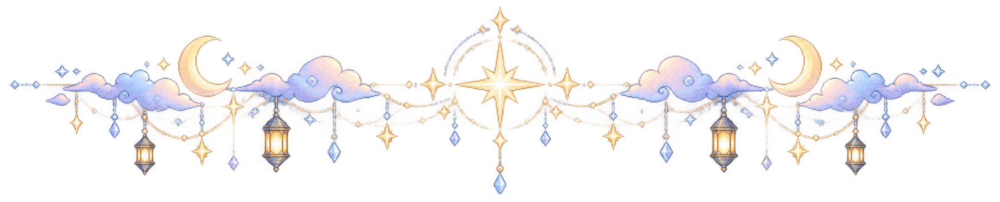

<picture>
  <source media="(prefers-color-scheme: dark)" srcset="./assets/banners/pixel-night-hero-dark.png">
  <source media="(prefers-color-scheme: light)" srcset="./assets/banners/pixel-night-hero-light.png">
  
</picture>

 

# Hi, I'm Aracel Nestova Aprilyanto 🌙

### Building with logic, creativity, and curiosity

  I’m an Informatics student who enjoys exploring technology through
  artificial intelligence, machine learning, computer vision, automation,
  and software development.

  I like creating things that feel thoughtful, useful, and visually engaging —
  where engineering meets creativity.

---

  

## About Me

I’m someone who enjoys turning ideas into systems, experiments, and digital experiences.  
My interests are centered around building technology that is not only functional, but also meaningful and well-crafted.

I enjoy learning deeply, refining details, and finding creative ways to solve technical problems.

- 🎓 Informatics student
- 🤖 Interested in AI and machine learning
- 👁️ Exploring computer vision and intelligent systems
- 🔧 Enjoy automation, systems, and software development
- 🌌 Drawn to calm, creative, and atmospheric design aesthetics

---

  

## Current Focus

Right now, I’m focusing on:

- Artificial Intelligence and Machine Learning
- Computer Vision and intelligent applications
- Automation workflows and system efficiency
- Software development and practical problem solving
- Continuous learning through building and experimentation

---

  

## Toolbox

### Languages

  
  
  

### Technologies

  
  
  
  
  
  

### Creative Side

  
  
  
  

---

  

## Night Notes

> I enjoy building things that combine precision and imagination.  
> For me, technology is not only about making something work —  
> it is also about making it feel clear, useful, and meaningful.

A few words that describe me:

- curious
- adaptable
- detail-oriented
- creative
- always learning

---

  

## GitHub Snapshot

  

  

---

  

## Connect With Me

  
  
  

   
  
    
  Thanks for visiting my corner of GitHub ✨

